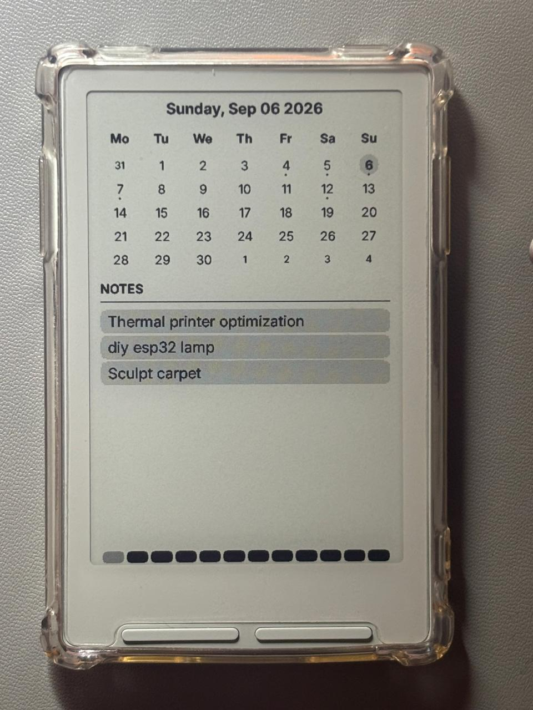

> **This is a personal fork of [CrossInk](https://github.com/uxjulia/CrossInk)**, which itself is based on [CrossPoint Reader](https://github.com/crosspoint-reader/crosspoint-reader).
>
> This fork keeps the existing CrossInk reading experience while adding a few personal workflow and UI changes. The main addition is **Calendar support for the Xteink X3**.
>
> **Warning: this Calendar firmware is for the Xteink X3 only. Do not install it on an Xteink X4.** Its RTC timer-wake and GPIO13 power handling target X3 hardware and are not supported on the X4.
>
> **Calendar is still under development.** Entries can be synced from BS-Pro over **ESP-NOW** or edited from the reader's local web interface.

### Supported Devices

- Xteink X3

## What's different in this fork

The main goal of this fork is to add a small productivity layer to CrossInk without changing its core reading experience.

### Sticky Notes

  
  

- Added **Calendar** support to the Xteink X3.
- Added an optional **Hourglass Clock** footer to the Calendar sleep screen. Its 24 rounded hour blocks fill throughout the day, with automatic battery-powered updates every 30 minutes, 1 hour, 3 hours, 6 hours, 12 hours, or 24 hours.
- Calendar entries can be viewed, added, edited, and deleted from a phone or computer through the reader's local web interface.
- Opening **Calendar** shows the full month view while ESP-NOW listens in the background. Use the short **Browse** shortcut beside Back to open File Transfer, then select **Calendar** in the browser.
- Any ESP32 can send notes using the documented [Sticky Notes ESP-NOW protocol](./docs/sticky-notes-esp-now-sender.md); BrokenSignal-Pro is not required.
- Received notes can be saved as the device's persistent sleep-screen note.
- On the `Minimal` / `Dashboard` home layout, Sticky Notes can be accessed directly from the front-button shortcuts, while file browsing remains available from the Menu.
- Additional input methods may be added as the feature develops.
